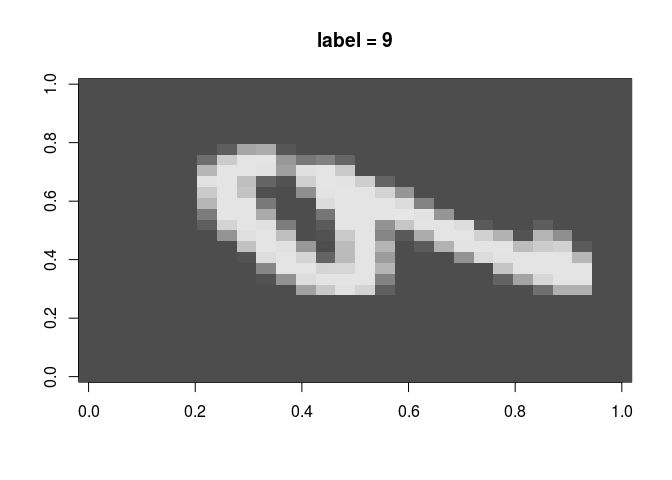
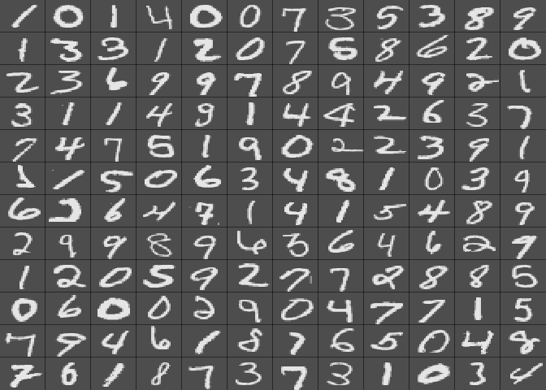
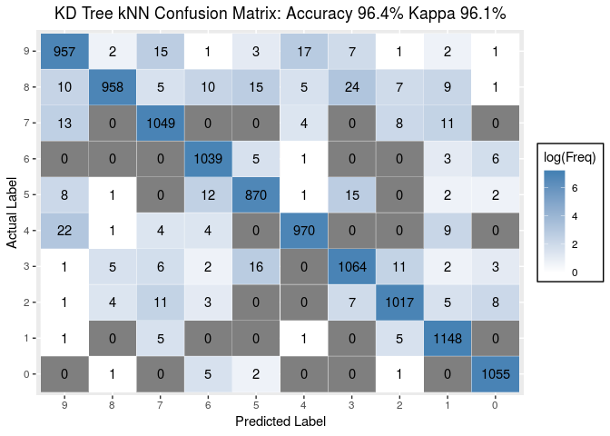
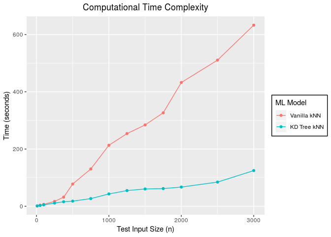
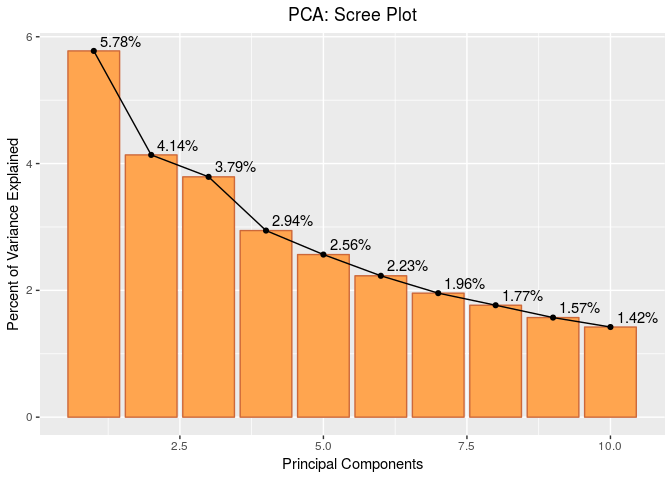
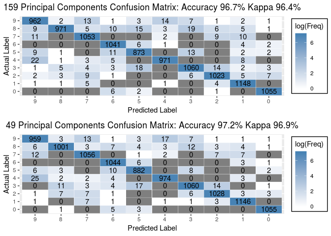

# Introduction
This is an Exploratory Data Analysis of the classic MNIST dataset. The data is available to download at [Kaggle](https://www.kaggle.com/c/digit-recognizer). The goal is to correctly classify digits `(0-9)` from a database of tens of thousands of gray-scale, handwritten images.

As a first step, I'll visualize a subset of the digits to get a sense of the data quality and to identify potential problems. Data preprocessing/cleaning will be performed if necessary. I'll then use `class:knn()` to train a k-nearest neighbor classifier. This model will be used as a benchmark for optimization. Next, I'll use `nabor::knn()` to store the training instances of the kNN algorithm in a KD tree data structure. This will improve the runtime performance of the model by providing faster lookup operations. To optimize the accuracy of the model, I will:

1) reduce the dimensionality of the feature space by performing a principal component analysis. 
2) fine-tune the value of `k` in knn by performing a 5-fold cross validation.

# Set up Environment
Load packages and import data files


```r
# Load Packages
# vis
library(knitr)    # dynamic report generation
library(ggplot2)  # visualization
library(scales)   # scale functions for visualization
library(gridExtra) # multi-panel plots

# wrangle
library(EBImage)  # image manipulation/processing
library(reshape2) # data frame manipulation
library(kableExtra) # HTML table manipulation
library(magrittr) # pipe commands

# model
library(class)    # kNN classification
suppressMessages(library(nabor))    # kd tree implementation of kNN
suppressMessages(library(caret))    # confusionMatrix 

# Import MNIST training & test datasets
train <- read.csv("../input/train.csv")
train$label <- as.factor(train$label)
test <- read.csv("../input/test.csv")
```

# Initial Exploration / Visualization

If we look at the structure of the data, we see that `train.csv` has a `label` column ranging from 0 to 9, and 784 `pixel#` columns. Each pixel has a single pixel-value associated with it, indicating the lightness or darkness of that pixel, with higher numbers meaning darker. The pixel-value is an integer between 0 and 255, inclusive.

The data documentation indicates that each image is 28 pixels in height and 28 pixels in width. The documentation describes in detail how the pixels for each digit are oriented in the CSV. With this information, I can quickly plot the pixel gray-scale intensity values to obtain an image of the digit.


```r
# Create 28x28 matrix containing the pixel gray-scale intensity values
m = matrix(unlist(train[12,-1]),nrow = 28, byrow = T)
# Plot the image
image(m,col=grey.colors(255), main = paste0("label = ",train[12,1]))
```

<div class="figure">

<p class="caption">Figure 1</p>
</div>

# Data Overview

The image need to be rotated along the x-axis to be readable. The `EBImage` package can be used for image processing and spacial transformations. Let's visualize a subset of the data. 


```r
# set up plot
par(mai=rep(0,4)) # no margins

# layout the plots into a matrix w/ 12 columns, by row
layout(matrix(1:144, ncol=12, byrow=T))

for (i in 1:144) {
  m <- rotate(matrix(unlist(train[i,-1]), 28,28, byrow = T), 270)
  image(m,col=grey.colors(255), xaxt='n', yaxt='n')
}
```



What do these images tell us?

- **Image Size**: All of the images in the dataset are the same `28x28` size. This is great. We want all images to be normalized to the same size.
- **Image Resolution**: The digits are low resolution, gray-scale images.
- **No single hand-drawn digits are identical**: As in natural handwriting, no single digits are perfectly identical, even when drawn by the same individual. Images of the same digit can be superimposed on one another and they will still won't perfectly align.
- **Digit variation**: The images appear to be drawn by different individuals.
- **Digit typography**: There are differences in how digits are stylized. For example, the number 7 can be drawn with or without a horizontal line through it. The number 4 can be drawn with a "tophat". The number 2 can be drawn with a a loop towards the bottom. The number 9 can be drawn with a straight vertical bar or with a curve. This further adds to the variation.


This is a lot to consider. Fortunately, we have over 40,000 labeled digits to train our supervised model.

The features available in this classification problem are the pixel-value intensities and the labels. The classification model that immediately comes to mind (and certainly the most simple and intuitive) is K-Nearest Neighbor (kNN). Each digit's 28x28 pixels represents a set of features. These set of features can be mapped onto a feature space, and subsequently used to classify new digits based on its proximity to its k-nearest neighbor in the feature space.

The strategy for setting up the data for modeling is as follows:

- Convert the 28x28 matrix of pixel-values into a 784 length vector. Each training instance will consist of a 784 length vector and an associated class label.
- We do not need to transform the data as we did before in visualization. The kNN algorithm interprets the digits as a set of feature vectors.
- Classification is done by calculating the Euclidean distance of the testing instance to every training instance.
- A label will be assigned to the testing instance based on the most common class among its k-nearest examples in the training set.

# K-Nearest Neighbor

## Train Model
Let's split the training data into a smaller training set and validation set. The validation set will be used to optimize the kNN model.


```r
set.seed(42)
# we will split the data using a 75/25, training/validation split
sample_rows <- sample(nrow(train), nrow(train)*0.75)

trainingSet <- train[sample_rows,]
validationSet <- train[-sample_rows,]

# function to track time in seconds
current_time<-function(display_time_elapse=FALSE){
  if (display_time_elapse){
    return((Sys.time()))
  } else {
   return(as.numeric(Sys.time())) 
  }
}

# train kNN model and record run time
start <- current_time(TRUE)
kNN_predictions <- class::knn(train = trainingSet[,-1], test = validationSet[,-1], cl = trainingSet[,1], k = 1)
class_kNN_time <- current_time(TRUE) - start
class_kNN_time
```

```
## Time difference of 36.08147 mins
```

The kNN algorithm from the `class` package took a little over half an hour to train the model. Let's look at the accuracy of the classifier.

## Confusion Matrix


```r
# construct confusion matrix
cfm <- confusionMatrix(kNN_predictions, validationSet$label)

# confusion matrix visualization
ggplotConfusionMatrix <- function(m,model){
  mytitle <- paste(model, "Confusion Matrix:", "Accuracy", percent_format()(m$overall[1]),
                   "Kappa", percent_format()(m$overall[2]))
  p <-
    ggplot(data = as.data.frame(m$table),
      aes(x = Prediction, y = Reference)) +
      ylab("Actual Label") + 
      xlab("Predicted Label") +
      geom_tile(aes(fill = log(Freq)), color = "white") +
      scale_fill_gradient(low = "white", high = "steelblue") +
      geom_text(aes(x = Prediction, y = Reference, label = Freq)) +
      theme(legend.position = "right") +
      scale_x_discrete(limits = rev(levels(as.data.frame(m$table)$Prediction))) +
      theme(legend.background = element_rect(color = 'black', fill = 'white', linetype='solid')) +
      ggtitle(mytitle) + theme(plot.title = element_text(hjust = 0.5))
  return(p)
}

# plot confusion matrix
ggplotConfusionMatrix(cfm, "Vanilla kNN")
```


## Computational Complexity Analysis

The kNN algoritm from the `class` package achieved an accuracy of $96.4\%$ when $k = 1$. The kNN model for the MNIST database has a fairly high baseline accuracy. Next, let's discuss the execution time of the model. The computational complexity of the kNN algorithm with $n$ pictures, $d$ pixels, and $k$ nearest neighbors is $$ \boxed{O(nd)} + O(nlogn) + O(k)$$

kNN is generally slow at the testing portion $O(nd)$ of the algorithm. This bottleneck of the complexity comes from having to compute the Euclidean distance of the test instance to every instance in the training set. I read from this [blog post](https://booking.ai/k-nearest-neighbours-from-slow-to-fast-thanks-to-maths-bec682357ccd) that we can improve the time complexity of the algorithm by implementating a [KD tree](https://en.wikipedia.org/wiki/K-d_tree).

The KD tree is a space-partioning data structure that dramatically improves the runtime performance of the classifier. The training instances are stored in a binary tree for effectively faster look up times. Consequently, unlike before, the test instance is not compared to *all* training examples. Instead the test instance is compared to $m<<n$ potential near neighbors. The insert and search operations of the KD tree have an average time complexity of $$O(nlogn)$$ where $n$ is the number of pictures.

The [nabor](https://cran.r-project.org/web/packages/nabor/nabor.pdf) package stores the training instances in a KD tree and the kNN model is approximated. We will use the `nabor` package to re-train the model.

# KD Tree kNN Algorithm

## Train Model


```r
# train KD Tree kNN model and track runtime
start <- current_time(TRUE)
kd_treeModel <- nabor::knn(data = trainingSet[,-1], query = validationSet[,-1], k = 1)
nabor_time <- current_time(TRUE) - start
nabor_time
```

```
## Time difference of 6.907541 mins
```

The kNN KD tree algorithm from the  `nabor` package took significantly less time to train and classify the data than the vanillla kNN model. Let's look at the accuracy of the classifier.

## Confusion Matrix


```r
get_KD_tree_prediction_labels<-function(kd_tree, trainData){
  
  get_k_nearest_votes<-function(i,trainData,kd_tree){
    k_nearest_votes <- trainData[c(kd_tree[i,]), 1]
    tt <- table(k_nearest_votes)
    most_common_label <- names(tt[which.max(tt)])
    return(most_common_label)
  }

  count <- nrow(kd_tree)
  
  labeled_predictions <- NA
  
  for (i in 1:count){
    labeled_predictions[i] <- get_k_nearest_votes(i,trainData,kd_tree)
  }
  labeled_predictions <- factor(labeled_predictions, levels = 0:9)
  
  return(labeled_predictions)
}

kd_tree_predictions <- get_KD_tree_prediction_labels(kd_treeModel$nn.idx,trainingSet)

cfm <- confusionMatrix(kd_tree_predictions, validationSet$label)

ggplotConfusionMatrix(cfm, "KD Tree kNN")
```



# Evaluate and Compare Models

The results from Figures $3$ and $4$ above show that the KD Tree kNN Algorithm model has a better time complexity than the Vanilla kNN algortihm whilst maintaining the same level of accuracy. The confusion matrices of the two models are identical.

As a proof of concept, we can plot the computational time complexity of both models with several $n$ test instance sizes.


```r
xnums <- c(10,50,100,250,375,500,750,1000,1250,1500,1750,2000, 2500, 3000)
vanilla_knn <- rep(NA, length(xnums))
knn_kd_tree <- rep(NA, length(xnums))

get_execution_time<-function(n){
  
  start_time <- current_time()
  predictions<-class::knn(trainingSet[,-1], validationSet[c(1:n),-1], trainingSet[,1], k = 1)
  end_time <- current_time()
  vanilla_knn_time <- end_time - start_time
  
  start_time <- current_time()
  kd_treeModel <- nabor::knn(trainingSet[,-1], validationSet[c(1:n),-1], k = 1)
  end_time <- current_time()
  knn_kd_time <- end_time - start_time
  output <- list(vanilla_knn_time, knn_kd_time)
  return(output)  # runtime in seconds
}

for(i in xnums){
  n <- match(i, xnums)
  execution_times <- unlist(get_execution_time(i))
  vanilla_knn[n] <- execution_times[1]
  knn_kd_tree[n] <- execution_times[2]
}

time_df <- data.frame(xnums,vanilla_knn, knn_kd_tree)
time_df_long <- melt(time_df, id="xnums")

ggplot(data=time_df_long, aes(x=xnums, y=value, color=variable)) +
  geom_line() + geom_point() +
  xlab("Test Input Size (n)") +
  ylab("Time (seconds)") +
  ggtitle("Computational Time Complexity") + 
  theme(plot.title = element_text(hjust = 0.5)) +
  scale_color_discrete(name = "ML Model", labels = c("Vanilla kNN", "KD Tree kNN")) +
  theme(legend.background = element_rect(color = 'black', fill = 'white', linetype='solid'))
```



The KD tree kNN model performs faster than the Vanilla implementation of kNN as the number of testing instances is increased.

Let's optimize the KD Tree kNN model performance.

# KD Tree kNN Model Optimization

+ Objective: Reduce the dimensionality of the feature space by performing a Principal Component Analysis.
+ Objective: Improve the accuracy of the model by optimizing for k in kNN. We will perform k-fold cross validation.

## Principal Component Analysis (PCA)

### Rational

I read from a [blog post](https://towardsdatascience.com/dimensionality-reduction-does-pca-really-improve-classification-outcome-6e9ba21f0a32) that reducing the number of features can dramatically improve the classification outcome. In the tutorial, the author trained a model with $18$ features for binary classification. The first model was a neural network using all features. This model achieved an accuracy of $54.6\%$. Next he performed a PCA on the dataset to reduce the $18$ features to $8$ principal components. He made a new dataset with the $8$ principal components and re-built the neural network. The new model achieved an accuracy of $97.7\%$. It would be interesting to see if we can similarly improve the accuracy of our KD tree kNN model by PCA.

Principal Component Analysis is a statistical technique for transforming a set of observations of possibly correlated variables into a set of linearly uncorrelated variables called principal components. By retaining principal components that explain a high proportion of the total variance, we effectively remove redundant features whilst minimizing the amount of information lost. PCA is not only a great dimensionality reduction technique, it can also be used for data compression to speed up the learning algorithm.

A related topic for discussion is a phenomena called __Curse of Dimensionality__. This usually occurs in highly dimensional features spaces. As the number of features increase, the amount of data that we need to generalize accurately grows exponently. When there are too many features in the input space, the amount of data available to accurately train the model becomes sparse. 

In our classification problem, each digit is represented by 784 features (28x28 resolution pixel values). Let's perform a principal component analysis to reduce the number of features.

### Analysis 

To begin the dimension reduction, we can remove pixels from the training data that contain whitespace among all images. These pixels correspond to the background of the images. These empty pixels do not help in the classification therefore we can confidently remove them.


```r
removeEmptyPixels<- function(trainData){
 allmisscols <- apply(trainData,2, function(x)all(x==0))
  colswithallmiss <-names(allmisscols[allmisscols>0])
  trainDataFrame <- trainData[, !names(train) %in% colswithallmiss]
  return(trainDataFrame)
}

trainDataFrame<-removeEmptyPixels(trainingSet)
```

Let's perform the principal component analysis and construct a data frame of the results.


```r
# principal components analysis using correlation matrix
computePrincipalComponents<-function(trainData){
  pca_df <- princomp(trainData[,-1], scores = T, cor=T)

  # Compute the eigenvalues of principal components from the standard deviation
  eig <- as.vector((pca_df$sdev)^2)

  # compute variances of principal components
  variance <- eig*100/sum(eig)

  # compute the cumulative variance
  cumvar <- cumsum(variance)

  df <- data.frame(PC = c(1:length(eig)), Eigenvalue = eig,"Variance Explained" = variance, "Cumulative Variance Explained" = cumvar)
  
  return(df)
}

princomp_df<-computePrincipalComponents(trainDataFrame)
```

### Principal Component Results

For dimension reduction, we will retain principal components with eigenvalues greater than 1. `Eigenvalues > 1` is a good heuristic rule of thumb. See `Figure 6`. 


```r
knitr::include_graphics("../input/Reference.png")
```

<div class="figure">

<p class="caption">Figure 6</p>
</div>

Let's make a dataframe of the filtered principal components.


```r
# exclude rows from dataframe where eigenvalue < 1
new_princomp_df <- princomp_df[princomp_df$Eigenvalue > 1,]
```

We can generate an HTML table of the filtered principal components. 


```r
kable(new_princomp_df) %>%
  kable_styling(c("striped", "bordered", "responsive")) %>%
  add_header_above(c("Principal Compnent Analysis Results" = 4)) %>%
  row_spec(0, bold = T, color = "white", background = "#666") %>%
  scroll_box(height = "400px")
```

<div style="border: 1px solid #ddd; padding: 5px; overflow-y: scroll; height:400px; "><table class="table table-striped table-bordered table-responsive" style="margin-left: auto; margin-right: auto;">
 <thead>
<tr><th style="border-bottom:hidden; padding-bottom:0; padding-left:3px;padding-right:3px;text-align: center; " colspan="4"><div style="border-bottom: 1px solid #ddd; padding-bottom: 5px;">Principal Compnent Analysis Results</div></th></tr>
  <tr>
   <th style="text-align:right;font-weight: bold;color: white;background-color: #666;"> PC </th>
   <th style="text-align:right;font-weight: bold;color: white;background-color: #666;"> Eigenvalue </th>
   <th style="text-align:right;font-weight: bold;color: white;background-color: #666;"> Variance.Explained </th>
   <th style="text-align:right;font-weight: bold;color: white;background-color: #666;"> Cumulative.Variance.Explained </th>
  </tr>
 </thead>
<tbody>
  <tr>
   <td style="text-align:right;"> 1 </td>
   <td style="text-align:right;"> 40.785439 </td>
   <td style="text-align:right;"> 5.7769744 </td>
   <td style="text-align:right;"> 5.776974 </td>
  </tr>
  <tr>
   <td style="text-align:right;"> 2 </td>
   <td style="text-align:right;"> 29.203806 </td>
   <td style="text-align:right;"> 4.1365164 </td>
   <td style="text-align:right;"> 9.913491 </td>
  </tr>
  <tr>
   <td style="text-align:right;"> 3 </td>
   <td style="text-align:right;"> 26.760640 </td>
   <td style="text-align:right;"> 3.7904590 </td>
   <td style="text-align:right;"> 13.703950 </td>
  </tr>
  <tr>
   <td style="text-align:right;"> 4 </td>
   <td style="text-align:right;"> 20.778514 </td>
   <td style="text-align:right;"> 2.9431323 </td>
   <td style="text-align:right;"> 16.647082 </td>
  </tr>
  <tr>
   <td style="text-align:right;"> 5 </td>
   <td style="text-align:right;"> 18.106538 </td>
   <td style="text-align:right;"> 2.5646654 </td>
   <td style="text-align:right;"> 19.211748 </td>
  </tr>
  <tr>
   <td style="text-align:right;"> 6 </td>
   <td style="text-align:right;"> 15.742120 </td>
   <td style="text-align:right;"> 2.2297620 </td>
   <td style="text-align:right;"> 21.441509 </td>
  </tr>
  <tr>
   <td style="text-align:right;"> 7 </td>
   <td style="text-align:right;"> 13.807888 </td>
   <td style="text-align:right;"> 1.9557915 </td>
   <td style="text-align:right;"> 23.397301 </td>
  </tr>
  <tr>
   <td style="text-align:right;"> 8 </td>
   <td style="text-align:right;"> 12.463289 </td>
   <td style="text-align:right;"> 1.7653384 </td>
   <td style="text-align:right;"> 25.162639 </td>
  </tr>
  <tr>
   <td style="text-align:right;"> 9 </td>
   <td style="text-align:right;"> 11.089303 </td>
   <td style="text-align:right;"> 1.5707228 </td>
   <td style="text-align:right;"> 26.733362 </td>
  </tr>
  <tr>
   <td style="text-align:right;"> 10 </td>
   <td style="text-align:right;"> 10.037146 </td>
   <td style="text-align:right;"> 1.4216920 </td>
   <td style="text-align:right;"> 28.155054 </td>
  </tr>
  <tr>
   <td style="text-align:right;"> 11 </td>
   <td style="text-align:right;"> 9.671364 </td>
   <td style="text-align:right;"> 1.3698816 </td>
   <td style="text-align:right;"> 29.524936 </td>
  </tr>
  <tr>
   <td style="text-align:right;"> 12 </td>
   <td style="text-align:right;"> 8.673066 </td>
   <td style="text-align:right;"> 1.2284796 </td>
   <td style="text-align:right;"> 30.753415 </td>
  </tr>
  <tr>
   <td style="text-align:right;"> 13 </td>
   <td style="text-align:right;"> 8.033350 </td>
   <td style="text-align:right;"> 1.1378682 </td>
   <td style="text-align:right;"> 31.891284 </td>
  </tr>
  <tr>
   <td style="text-align:right;"> 14 </td>
   <td style="text-align:right;"> 7.928454 </td>
   <td style="text-align:right;"> 1.1230105 </td>
   <td style="text-align:right;"> 33.014294 </td>
  </tr>
  <tr>
   <td style="text-align:right;"> 15 </td>
   <td style="text-align:right;"> 7.430107 </td>
   <td style="text-align:right;"> 1.0524230 </td>
   <td style="text-align:right;"> 34.066717 </td>
  </tr>
  <tr>
   <td style="text-align:right;"> 16 </td>
   <td style="text-align:right;"> 7.151772 </td>
   <td style="text-align:right;"> 1.0129988 </td>
   <td style="text-align:right;"> 35.079716 </td>
  </tr>
  <tr>
   <td style="text-align:right;"> 17 </td>
   <td style="text-align:right;"> 6.758783 </td>
   <td style="text-align:right;"> 0.9573347 </td>
   <td style="text-align:right;"> 36.037051 </td>
  </tr>
  <tr>
   <td style="text-align:right;"> 18 </td>
   <td style="text-align:right;"> 6.627955 </td>
   <td style="text-align:right;"> 0.9388038 </td>
   <td style="text-align:right;"> 36.975854 </td>
  </tr>
  <tr>
   <td style="text-align:right;"> 19 </td>
   <td style="text-align:right;"> 6.450296 </td>
   <td style="text-align:right;"> 0.9136396 </td>
   <td style="text-align:right;"> 37.889494 </td>
  </tr>
  <tr>
   <td style="text-align:right;"> 20 </td>
   <td style="text-align:right;"> 6.302166 </td>
   <td style="text-align:right;"> 0.8926581 </td>
   <td style="text-align:right;"> 38.782152 </td>
  </tr>
  <tr>
   <td style="text-align:right;"> 21 </td>
   <td style="text-align:right;"> 5.913115 </td>
   <td style="text-align:right;"> 0.8375517 </td>
   <td style="text-align:right;"> 39.619704 </td>
  </tr>
  <tr>
   <td style="text-align:right;"> 22 </td>
   <td style="text-align:right;"> 5.737276 </td>
   <td style="text-align:right;"> 0.8126453 </td>
   <td style="text-align:right;"> 40.432349 </td>
  </tr>
  <tr>
   <td style="text-align:right;"> 23 </td>
   <td style="text-align:right;"> 5.482075 </td>
   <td style="text-align:right;"> 0.7764979 </td>
   <td style="text-align:right;"> 41.208847 </td>
  </tr>
  <tr>
   <td style="text-align:right;"> 24 </td>
   <td style="text-align:right;"> 5.374899 </td>
   <td style="text-align:right;"> 0.7613172 </td>
   <td style="text-align:right;"> 41.970164 </td>
  </tr>
  <tr>
   <td style="text-align:right;"> 25 </td>
   <td style="text-align:right;"> 5.204479 </td>
   <td style="text-align:right;"> 0.7371783 </td>
   <td style="text-align:right;"> 42.707343 </td>
  </tr>
  <tr>
   <td style="text-align:right;"> 26 </td>
   <td style="text-align:right;"> 4.974165 </td>
   <td style="text-align:right;"> 0.7045560 </td>
   <td style="text-align:right;"> 43.411899 </td>
  </tr>
  <tr>
   <td style="text-align:right;"> 27 </td>
   <td style="text-align:right;"> 4.897580 </td>
   <td style="text-align:right;"> 0.6937082 </td>
   <td style="text-align:right;"> 44.105607 </td>
  </tr>
  <tr>
   <td style="text-align:right;"> 28 </td>
   <td style="text-align:right;"> 4.688801 </td>
   <td style="text-align:right;"> 0.6641361 </td>
   <td style="text-align:right;"> 44.769743 </td>
  </tr>
  <tr>
   <td style="text-align:right;"> 29 </td>
   <td style="text-align:right;"> 4.478469 </td>
   <td style="text-align:right;"> 0.6343441 </td>
   <td style="text-align:right;"> 45.404087 </td>
  </tr>
  <tr>
   <td style="text-align:right;"> 30 </td>
   <td style="text-align:right;"> 4.432175 </td>
   <td style="text-align:right;"> 0.6277869 </td>
   <td style="text-align:right;"> 46.031874 </td>
  </tr>
  <tr>
   <td style="text-align:right;"> 31 </td>
   <td style="text-align:right;"> 4.337247 </td>
   <td style="text-align:right;"> 0.6143410 </td>
   <td style="text-align:right;"> 46.646215 </td>
  </tr>
  <tr>
   <td style="text-align:right;"> 32 </td>
   <td style="text-align:right;"> 4.260045 </td>
   <td style="text-align:right;"> 0.6034058 </td>
   <td style="text-align:right;"> 47.249621 </td>
  </tr>
  <tr>
   <td style="text-align:right;"> 33 </td>
   <td style="text-align:right;"> 4.097587 </td>
   <td style="text-align:right;"> 0.5803948 </td>
   <td style="text-align:right;"> 47.830016 </td>
  </tr>
  <tr>
   <td style="text-align:right;"> 34 </td>
   <td style="text-align:right;"> 4.065460 </td>
   <td style="text-align:right;"> 0.5758442 </td>
   <td style="text-align:right;"> 48.405860 </td>
  </tr>
  <tr>
   <td style="text-align:right;"> 35 </td>
   <td style="text-align:right;"> 4.015096 </td>
   <td style="text-align:right;"> 0.5687104 </td>
   <td style="text-align:right;"> 48.974570 </td>
  </tr>
  <tr>
   <td style="text-align:right;"> 36 </td>
   <td style="text-align:right;"> 3.852994 </td>
   <td style="text-align:right;"> 0.5457499 </td>
   <td style="text-align:right;"> 49.520320 </td>
  </tr>
  <tr>
   <td style="text-align:right;"> 37 </td>
   <td style="text-align:right;"> 3.831807 </td>
   <td style="text-align:right;"> 0.5427488 </td>
   <td style="text-align:right;"> 50.063069 </td>
  </tr>
  <tr>
   <td style="text-align:right;"> 38 </td>
   <td style="text-align:right;"> 3.751939 </td>
   <td style="text-align:right;"> 0.5314361 </td>
   <td style="text-align:right;"> 50.594505 </td>
  </tr>
  <tr>
   <td style="text-align:right;"> 39 </td>
   <td style="text-align:right;"> 3.597863 </td>
   <td style="text-align:right;"> 0.5096124 </td>
   <td style="text-align:right;"> 51.104117 </td>
  </tr>
  <tr>
   <td style="text-align:right;"> 40 </td>
   <td style="text-align:right;"> 3.524305 </td>
   <td style="text-align:right;"> 0.4991933 </td>
   <td style="text-align:right;"> 51.603311 </td>
  </tr>
  <tr>
   <td style="text-align:right;"> 41 </td>
   <td style="text-align:right;"> 3.452628 </td>
   <td style="text-align:right;"> 0.4890407 </td>
   <td style="text-align:right;"> 52.092351 </td>
  </tr>
  <tr>
   <td style="text-align:right;"> 42 </td>
   <td style="text-align:right;"> 3.387091 </td>
   <td style="text-align:right;"> 0.4797579 </td>
   <td style="text-align:right;"> 52.572109 </td>
  </tr>
  <tr>
   <td style="text-align:right;"> 43 </td>
   <td style="text-align:right;"> 3.321853 </td>
   <td style="text-align:right;"> 0.4705174 </td>
   <td style="text-align:right;"> 53.042627 </td>
  </tr>
  <tr>
   <td style="text-align:right;"> 44 </td>
   <td style="text-align:right;"> 3.308902 </td>
   <td style="text-align:right;"> 0.4686831 </td>
   <td style="text-align:right;"> 53.511310 </td>
  </tr>
  <tr>
   <td style="text-align:right;"> 45 </td>
   <td style="text-align:right;"> 3.244350 </td>
   <td style="text-align:right;"> 0.4595396 </td>
   <td style="text-align:right;"> 53.970849 </td>
  </tr>
  <tr>
   <td style="text-align:right;"> 46 </td>
   <td style="text-align:right;"> 3.200576 </td>
   <td style="text-align:right;"> 0.4533394 </td>
   <td style="text-align:right;"> 54.424189 </td>
  </tr>
  <tr>
   <td style="text-align:right;"> 47 </td>
   <td style="text-align:right;"> 3.154652 </td>
   <td style="text-align:right;"> 0.4468345 </td>
   <td style="text-align:right;"> 54.871023 </td>
  </tr>
  <tr>
   <td style="text-align:right;"> 48 </td>
   <td style="text-align:right;"> 3.146432 </td>
   <td style="text-align:right;"> 0.4456702 </td>
   <td style="text-align:right;"> 55.316693 </td>
  </tr>
  <tr>
   <td style="text-align:right;"> 49 </td>
   <td style="text-align:right;"> 3.067260 </td>
   <td style="text-align:right;"> 0.4344561 </td>
   <td style="text-align:right;"> 55.751150 </td>
  </tr>
  <tr>
   <td style="text-align:right;"> 50 </td>
   <td style="text-align:right;"> 3.040402 </td>
   <td style="text-align:right;"> 0.4306518 </td>
   <td style="text-align:right;"> 56.181801 </td>
  </tr>
  <tr>
   <td style="text-align:right;"> 51 </td>
   <td style="text-align:right;"> 2.971235 </td>
   <td style="text-align:right;"> 0.4208548 </td>
   <td style="text-align:right;"> 56.602656 </td>
  </tr>
  <tr>
   <td style="text-align:right;"> 52 </td>
   <td style="text-align:right;"> 2.932732 </td>
   <td style="text-align:right;"> 0.4154011 </td>
   <td style="text-align:right;"> 57.018057 </td>
  </tr>
  <tr>
   <td style="text-align:right;"> 53 </td>
   <td style="text-align:right;"> 2.900722 </td>
   <td style="text-align:right;"> 0.4108671 </td>
   <td style="text-align:right;"> 57.428924 </td>
  </tr>
  <tr>
   <td style="text-align:right;"> 54 </td>
   <td style="text-align:right;"> 2.841400 </td>
   <td style="text-align:right;"> 0.4024646 </td>
   <td style="text-align:right;"> 57.831389 </td>
  </tr>
  <tr>
   <td style="text-align:right;"> 55 </td>
   <td style="text-align:right;"> 2.799752 </td>
   <td style="text-align:right;"> 0.3965655 </td>
   <td style="text-align:right;"> 58.227954 </td>
  </tr>
  <tr>
   <td style="text-align:right;"> 56 </td>
   <td style="text-align:right;"> 2.790456 </td>
   <td style="text-align:right;"> 0.3952487 </td>
   <td style="text-align:right;"> 58.623203 </td>
  </tr>
  <tr>
   <td style="text-align:right;"> 57 </td>
   <td style="text-align:right;"> 2.740900 </td>
   <td style="text-align:right;"> 0.3882294 </td>
   <td style="text-align:right;"> 59.011433 </td>
  </tr>
  <tr>
   <td style="text-align:right;"> 58 </td>
   <td style="text-align:right;"> 2.686503 </td>
   <td style="text-align:right;"> 0.3805245 </td>
   <td style="text-align:right;"> 59.391957 </td>
  </tr>
  <tr>
   <td style="text-align:right;"> 59 </td>
   <td style="text-align:right;"> 2.666955 </td>
   <td style="text-align:right;"> 0.3777556 </td>
   <td style="text-align:right;"> 59.769713 </td>
  </tr>
  <tr>
   <td style="text-align:right;"> 60 </td>
   <td style="text-align:right;"> 2.634287 </td>
   <td style="text-align:right;"> 0.3731285 </td>
   <td style="text-align:right;"> 60.142841 </td>
  </tr>
  <tr>
   <td style="text-align:right;"> 61 </td>
   <td style="text-align:right;"> 2.541794 </td>
   <td style="text-align:right;"> 0.3600275 </td>
   <td style="text-align:right;"> 60.502869 </td>
  </tr>
  <tr>
   <td style="text-align:right;"> 62 </td>
   <td style="text-align:right;"> 2.523658 </td>
   <td style="text-align:right;"> 0.3574587 </td>
   <td style="text-align:right;"> 60.860327 </td>
  </tr>
  <tr>
   <td style="text-align:right;"> 63 </td>
   <td style="text-align:right;"> 2.467274 </td>
   <td style="text-align:right;"> 0.3494722 </td>
   <td style="text-align:right;"> 61.209800 </td>
  </tr>
  <tr>
   <td style="text-align:right;"> 64 </td>
   <td style="text-align:right;"> 2.459200 </td>
   <td style="text-align:right;"> 0.3483286 </td>
   <td style="text-align:right;"> 61.558128 </td>
  </tr>
  <tr>
   <td style="text-align:right;"> 65 </td>
   <td style="text-align:right;"> 2.439964 </td>
   <td style="text-align:right;"> 0.3456040 </td>
   <td style="text-align:right;"> 61.903732 </td>
  </tr>
  <tr>
   <td style="text-align:right;"> 66 </td>
   <td style="text-align:right;"> 2.374353 </td>
   <td style="text-align:right;"> 0.3363106 </td>
   <td style="text-align:right;"> 62.240043 </td>
  </tr>
  <tr>
   <td style="text-align:right;"> 67 </td>
   <td style="text-align:right;"> 2.368244 </td>
   <td style="text-align:right;"> 0.3354453 </td>
   <td style="text-align:right;"> 62.575488 </td>
  </tr>
  <tr>
   <td style="text-align:right;"> 68 </td>
   <td style="text-align:right;"> 2.353653 </td>
   <td style="text-align:right;"> 0.3333786 </td>
   <td style="text-align:right;"> 62.908867 </td>
  </tr>
  <tr>
   <td style="text-align:right;"> 69 </td>
   <td style="text-align:right;"> 2.276250 </td>
   <td style="text-align:right;"> 0.3224150 </td>
   <td style="text-align:right;"> 63.231282 </td>
  </tr>
  <tr>
   <td style="text-align:right;"> 70 </td>
   <td style="text-align:right;"> 2.262620 </td>
   <td style="text-align:right;"> 0.3204844 </td>
   <td style="text-align:right;"> 63.551766 </td>
  </tr>
  <tr>
   <td style="text-align:right;"> 71 </td>
   <td style="text-align:right;"> 2.235628 </td>
   <td style="text-align:right;"> 0.3166612 </td>
   <td style="text-align:right;"> 63.868427 </td>
  </tr>
  <tr>
   <td style="text-align:right;"> 72 </td>
   <td style="text-align:right;"> 2.219180 </td>
   <td style="text-align:right;"> 0.3143314 </td>
   <td style="text-align:right;"> 64.182759 </td>
  </tr>
  <tr>
   <td style="text-align:right;"> 73 </td>
   <td style="text-align:right;"> 2.199981 </td>
   <td style="text-align:right;"> 0.3116120 </td>
   <td style="text-align:right;"> 64.494371 </td>
  </tr>
  <tr>
   <td style="text-align:right;"> 74 </td>
   <td style="text-align:right;"> 2.173328 </td>
   <td style="text-align:right;"> 0.3078369 </td>
   <td style="text-align:right;"> 64.802207 </td>
  </tr>
  <tr>
   <td style="text-align:right;"> 75 </td>
   <td style="text-align:right;"> 2.152361 </td>
   <td style="text-align:right;"> 0.3048670 </td>
   <td style="text-align:right;"> 65.107074 </td>
  </tr>
  <tr>
   <td style="text-align:right;"> 76 </td>
   <td style="text-align:right;"> 2.134864 </td>
   <td style="text-align:right;"> 0.3023887 </td>
   <td style="text-align:right;"> 65.409463 </td>
  </tr>
  <tr>
   <td style="text-align:right;"> 77 </td>
   <td style="text-align:right;"> 2.107172 </td>
   <td style="text-align:right;"> 0.2984664 </td>
   <td style="text-align:right;"> 65.707930 </td>
  </tr>
  <tr>
   <td style="text-align:right;"> 78 </td>
   <td style="text-align:right;"> 2.080476 </td>
   <td style="text-align:right;"> 0.2946850 </td>
   <td style="text-align:right;"> 66.002615 </td>
  </tr>
  <tr>
   <td style="text-align:right;"> 79 </td>
   <td style="text-align:right;"> 2.052091 </td>
   <td style="text-align:right;"> 0.2906645 </td>
   <td style="text-align:right;"> 66.293279 </td>
  </tr>
  <tr>
   <td style="text-align:right;"> 80 </td>
   <td style="text-align:right;"> 2.045284 </td>
   <td style="text-align:right;"> 0.2897003 </td>
   <td style="text-align:right;"> 66.582979 </td>
  </tr>
  <tr>
   <td style="text-align:right;"> 81 </td>
   <td style="text-align:right;"> 2.038149 </td>
   <td style="text-align:right;"> 0.2886896 </td>
   <td style="text-align:right;"> 66.871669 </td>
  </tr>
  <tr>
   <td style="text-align:right;"> 82 </td>
   <td style="text-align:right;"> 2.004339 </td>
   <td style="text-align:right;"> 0.2839006 </td>
   <td style="text-align:right;"> 67.155569 </td>
  </tr>
  <tr>
   <td style="text-align:right;"> 83 </td>
   <td style="text-align:right;"> 1.994818 </td>
   <td style="text-align:right;"> 0.2825521 </td>
   <td style="text-align:right;"> 67.438122 </td>
  </tr>
  <tr>
   <td style="text-align:right;"> 84 </td>
   <td style="text-align:right;"> 1.989158 </td>
   <td style="text-align:right;"> 0.2817504 </td>
   <td style="text-align:right;"> 67.719872 </td>
  </tr>
  <tr>
   <td style="text-align:right;"> 85 </td>
   <td style="text-align:right;"> 1.974063 </td>
   <td style="text-align:right;"> 0.2796123 </td>
   <td style="text-align:right;"> 67.999484 </td>
  </tr>
  <tr>
   <td style="text-align:right;"> 86 </td>
   <td style="text-align:right;"> 1.963117 </td>
   <td style="text-align:right;"> 0.2780619 </td>
   <td style="text-align:right;"> 68.277546 </td>
  </tr>
  <tr>
   <td style="text-align:right;"> 87 </td>
   <td style="text-align:right;"> 1.941347 </td>
   <td style="text-align:right;"> 0.2749783 </td>
   <td style="text-align:right;"> 68.552524 </td>
  </tr>
  <tr>
   <td style="text-align:right;"> 88 </td>
   <td style="text-align:right;"> 1.924542 </td>
   <td style="text-align:right;"> 0.2725980 </td>
   <td style="text-align:right;"> 68.825122 </td>
  </tr>
  <tr>
   <td style="text-align:right;"> 89 </td>
   <td style="text-align:right;"> 1.913162 </td>
   <td style="text-align:right;"> 0.2709862 </td>
   <td style="text-align:right;"> 69.096108 </td>
  </tr>
  <tr>
   <td style="text-align:right;"> 90 </td>
   <td style="text-align:right;"> 1.905256 </td>
   <td style="text-align:right;"> 0.2698663 </td>
   <td style="text-align:right;"> 69.365975 </td>
  </tr>
  <tr>
   <td style="text-align:right;"> 91 </td>
   <td style="text-align:right;"> 1.868284 </td>
   <td style="text-align:right;"> 0.2646295 </td>
   <td style="text-align:right;"> 69.630604 </td>
  </tr>
  <tr>
   <td style="text-align:right;"> 92 </td>
   <td style="text-align:right;"> 1.849384 </td>
   <td style="text-align:right;"> 0.2619524 </td>
   <td style="text-align:right;"> 69.892557 </td>
  </tr>
  <tr>
   <td style="text-align:right;"> 93 </td>
   <td style="text-align:right;"> 1.832798 </td>
   <td style="text-align:right;"> 0.2596030 </td>
   <td style="text-align:right;"> 70.152160 </td>
  </tr>
  <tr>
   <td style="text-align:right;"> 94 </td>
   <td style="text-align:right;"> 1.815964 </td>
   <td style="text-align:right;"> 0.2572188 </td>
   <td style="text-align:right;"> 70.409379 </td>
  </tr>
  <tr>
   <td style="text-align:right;"> 95 </td>
   <td style="text-align:right;"> 1.787880 </td>
   <td style="text-align:right;"> 0.2532408 </td>
   <td style="text-align:right;"> 70.662619 </td>
  </tr>
  <tr>
   <td style="text-align:right;"> 96 </td>
   <td style="text-align:right;"> 1.778162 </td>
   <td style="text-align:right;"> 0.2518643 </td>
   <td style="text-align:right;"> 70.914484 </td>
  </tr>
  <tr>
   <td style="text-align:right;"> 97 </td>
   <td style="text-align:right;"> 1.758033 </td>
   <td style="text-align:right;"> 0.2490131 </td>
   <td style="text-align:right;"> 71.163497 </td>
  </tr>
  <tr>
   <td style="text-align:right;"> 98 </td>
   <td style="text-align:right;"> 1.747077 </td>
   <td style="text-align:right;"> 0.2474613 </td>
   <td style="text-align:right;"> 71.410958 </td>
  </tr>
  <tr>
   <td style="text-align:right;"> 99 </td>
   <td style="text-align:right;"> 1.717969 </td>
   <td style="text-align:right;"> 0.2433384 </td>
   <td style="text-align:right;"> 71.654296 </td>
  </tr>
  <tr>
   <td style="text-align:right;"> 100 </td>
   <td style="text-align:right;"> 1.688094 </td>
   <td style="text-align:right;"> 0.2391069 </td>
   <td style="text-align:right;"> 71.893403 </td>
  </tr>
  <tr>
   <td style="text-align:right;"> 101 </td>
   <td style="text-align:right;"> 1.670366 </td>
   <td style="text-align:right;"> 0.2365958 </td>
   <td style="text-align:right;"> 72.129999 </td>
  </tr>
  <tr>
   <td style="text-align:right;"> 102 </td>
   <td style="text-align:right;"> 1.660331 </td>
   <td style="text-align:right;"> 0.2351744 </td>
   <td style="text-align:right;"> 72.365173 </td>
  </tr>
  <tr>
   <td style="text-align:right;"> 103 </td>
   <td style="text-align:right;"> 1.650670 </td>
   <td style="text-align:right;"> 0.2338060 </td>
   <td style="text-align:right;"> 72.598979 </td>
  </tr>
  <tr>
   <td style="text-align:right;"> 104 </td>
   <td style="text-align:right;"> 1.648016 </td>
   <td style="text-align:right;"> 0.2334301 </td>
   <td style="text-align:right;"> 72.832409 </td>
  </tr>
  <tr>
   <td style="text-align:right;"> 105 </td>
   <td style="text-align:right;"> 1.621478 </td>
   <td style="text-align:right;"> 0.2296711 </td>
   <td style="text-align:right;"> 73.062080 </td>
  </tr>
  <tr>
   <td style="text-align:right;"> 106 </td>
   <td style="text-align:right;"> 1.611681 </td>
   <td style="text-align:right;"> 0.2282834 </td>
   <td style="text-align:right;"> 73.290364 </td>
  </tr>
  <tr>
   <td style="text-align:right;"> 107 </td>
   <td style="text-align:right;"> 1.596074 </td>
   <td style="text-align:right;"> 0.2260728 </td>
   <td style="text-align:right;"> 73.516437 </td>
  </tr>
  <tr>
   <td style="text-align:right;"> 108 </td>
   <td style="text-align:right;"> 1.586211 </td>
   <td style="text-align:right;"> 0.2246758 </td>
   <td style="text-align:right;"> 73.741113 </td>
  </tr>
  <tr>
   <td style="text-align:right;"> 109 </td>
   <td style="text-align:right;"> 1.571774 </td>
   <td style="text-align:right;"> 0.2226309 </td>
   <td style="text-align:right;"> 73.963744 </td>
  </tr>
  <tr>
   <td style="text-align:right;"> 110 </td>
   <td style="text-align:right;"> 1.551543 </td>
   <td style="text-align:right;"> 0.2197653 </td>
   <td style="text-align:right;"> 74.183509 </td>
  </tr>
  <tr>
   <td style="text-align:right;"> 111 </td>
   <td style="text-align:right;"> 1.535090 </td>
   <td style="text-align:right;"> 0.2174349 </td>
   <td style="text-align:right;"> 74.400944 </td>
  </tr>
  <tr>
   <td style="text-align:right;"> 112 </td>
   <td style="text-align:right;"> 1.508619 </td>
   <td style="text-align:right;"> 0.2136853 </td>
   <td style="text-align:right;"> 74.614629 </td>
  </tr>
  <tr>
   <td style="text-align:right;"> 113 </td>
   <td style="text-align:right;"> 1.499523 </td>
   <td style="text-align:right;"> 0.2123970 </td>
   <td style="text-align:right;"> 74.827026 </td>
  </tr>
  <tr>
   <td style="text-align:right;"> 114 </td>
   <td style="text-align:right;"> 1.492858 </td>
   <td style="text-align:right;"> 0.2114529 </td>
   <td style="text-align:right;"> 75.038479 </td>
  </tr>
  <tr>
   <td style="text-align:right;"> 115 </td>
   <td style="text-align:right;"> 1.472022 </td>
   <td style="text-align:right;"> 0.2085017 </td>
   <td style="text-align:right;"> 75.246981 </td>
  </tr>
  <tr>
   <td style="text-align:right;"> 116 </td>
   <td style="text-align:right;"> 1.443340 </td>
   <td style="text-align:right;"> 0.2044392 </td>
   <td style="text-align:right;"> 75.451420 </td>
  </tr>
  <tr>
   <td style="text-align:right;"> 117 </td>
   <td style="text-align:right;"> 1.438527 </td>
   <td style="text-align:right;"> 0.2037574 </td>
   <td style="text-align:right;"> 75.655177 </td>
  </tr>
  <tr>
   <td style="text-align:right;"> 118 </td>
   <td style="text-align:right;"> 1.413418 </td>
   <td style="text-align:right;"> 0.2002009 </td>
   <td style="text-align:right;"> 75.855378 </td>
  </tr>
  <tr>
   <td style="text-align:right;"> 119 </td>
   <td style="text-align:right;"> 1.396139 </td>
   <td style="text-align:right;"> 0.1977533 </td>
   <td style="text-align:right;"> 76.053131 </td>
  </tr>
  <tr>
   <td style="text-align:right;"> 120 </td>
   <td style="text-align:right;"> 1.387957 </td>
   <td style="text-align:right;"> 0.1965944 </td>
   <td style="text-align:right;"> 76.249726 </td>
  </tr>
  <tr>
   <td style="text-align:right;"> 121 </td>
   <td style="text-align:right;"> 1.382484 </td>
   <td style="text-align:right;"> 0.1958193 </td>
   <td style="text-align:right;"> 76.445545 </td>
  </tr>
  <tr>
   <td style="text-align:right;"> 122 </td>
   <td style="text-align:right;"> 1.361487 </td>
   <td style="text-align:right;"> 0.1928452 </td>
   <td style="text-align:right;"> 76.638390 </td>
  </tr>
  <tr>
   <td style="text-align:right;"> 123 </td>
   <td style="text-align:right;"> 1.349303 </td>
   <td style="text-align:right;"> 0.1911194 </td>
   <td style="text-align:right;"> 76.829510 </td>
  </tr>
  <tr>
   <td style="text-align:right;"> 124 </td>
   <td style="text-align:right;"> 1.338809 </td>
   <td style="text-align:right;"> 0.1896329 </td>
   <td style="text-align:right;"> 77.019143 </td>
  </tr>
  <tr>
   <td style="text-align:right;"> 125 </td>
   <td style="text-align:right;"> 1.315599 </td>
   <td style="text-align:right;"> 0.1863455 </td>
   <td style="text-align:right;"> 77.205488 </td>
  </tr>
  <tr>
   <td style="text-align:right;"> 126 </td>
   <td style="text-align:right;"> 1.303301 </td>
   <td style="text-align:right;"> 0.1846036 </td>
   <td style="text-align:right;"> 77.390092 </td>
  </tr>
  <tr>
   <td style="text-align:right;"> 127 </td>
   <td style="text-align:right;"> 1.293498 </td>
   <td style="text-align:right;"> 0.1832150 </td>
   <td style="text-align:right;"> 77.573307 </td>
  </tr>
  <tr>
   <td style="text-align:right;"> 128 </td>
   <td style="text-align:right;"> 1.285998 </td>
   <td style="text-align:right;"> 0.1821527 </td>
   <td style="text-align:right;"> 77.755459 </td>
  </tr>
  <tr>
   <td style="text-align:right;"> 129 </td>
   <td style="text-align:right;"> 1.266967 </td>
   <td style="text-align:right;"> 0.1794571 </td>
   <td style="text-align:right;"> 77.934916 </td>
  </tr>
  <tr>
   <td style="text-align:right;"> 130 </td>
   <td style="text-align:right;"> 1.261629 </td>
   <td style="text-align:right;"> 0.1787011 </td>
   <td style="text-align:right;"> 78.113618 </td>
  </tr>
  <tr>
   <td style="text-align:right;"> 131 </td>
   <td style="text-align:right;"> 1.253372 </td>
   <td style="text-align:right;"> 0.1775315 </td>
   <td style="text-align:right;"> 78.291149 </td>
  </tr>
  <tr>
   <td style="text-align:right;"> 132 </td>
   <td style="text-align:right;"> 1.234522 </td>
   <td style="text-align:right;"> 0.1748614 </td>
   <td style="text-align:right;"> 78.466010 </td>
  </tr>
  <tr>
   <td style="text-align:right;"> 133 </td>
   <td style="text-align:right;"> 1.228912 </td>
   <td style="text-align:right;"> 0.1740669 </td>
   <td style="text-align:right;"> 78.640077 </td>
  </tr>
  <tr>
   <td style="text-align:right;"> 134 </td>
   <td style="text-align:right;"> 1.220501 </td>
   <td style="text-align:right;"> 0.1728755 </td>
   <td style="text-align:right;"> 78.812953 </td>
  </tr>
  <tr>
   <td style="text-align:right;"> 135 </td>
   <td style="text-align:right;"> 1.208063 </td>
   <td style="text-align:right;"> 0.1711137 </td>
   <td style="text-align:right;"> 78.984067 </td>
  </tr>
  <tr>
   <td style="text-align:right;"> 136 </td>
   <td style="text-align:right;"> 1.196307 </td>
   <td style="text-align:right;"> 0.1694485 </td>
   <td style="text-align:right;"> 79.153515 </td>
  </tr>
  <tr>
   <td style="text-align:right;"> 137 </td>
   <td style="text-align:right;"> 1.186434 </td>
   <td style="text-align:right;"> 0.1680502 </td>
   <td style="text-align:right;"> 79.321565 </td>
  </tr>
  <tr>
   <td style="text-align:right;"> 138 </td>
   <td style="text-align:right;"> 1.177051 </td>
   <td style="text-align:right;"> 0.1667211 </td>
   <td style="text-align:right;"> 79.488286 </td>
  </tr>
  <tr>
   <td style="text-align:right;"> 139 </td>
   <td style="text-align:right;"> 1.161138 </td>
   <td style="text-align:right;"> 0.1644671 </td>
   <td style="text-align:right;"> 79.652754 </td>
  </tr>
  <tr>
   <td style="text-align:right;"> 140 </td>
   <td style="text-align:right;"> 1.143044 </td>
   <td style="text-align:right;"> 0.1619043 </td>
   <td style="text-align:right;"> 79.814658 </td>
  </tr>
  <tr>
   <td style="text-align:right;"> 141 </td>
   <td style="text-align:right;"> 1.132914 </td>
   <td style="text-align:right;"> 0.1604694 </td>
   <td style="text-align:right;"> 79.975127 </td>
  </tr>
  <tr>
   <td style="text-align:right;"> 142 </td>
   <td style="text-align:right;"> 1.121481 </td>
   <td style="text-align:right;"> 0.1588500 </td>
   <td style="text-align:right;"> 80.133977 </td>
  </tr>
  <tr>
   <td style="text-align:right;"> 143 </td>
   <td style="text-align:right;"> 1.115372 </td>
   <td style="text-align:right;"> 0.1579847 </td>
   <td style="text-align:right;"> 80.291962 </td>
  </tr>
  <tr>
   <td style="text-align:right;"> 144 </td>
   <td style="text-align:right;"> 1.106983 </td>
   <td style="text-align:right;"> 0.1567965 </td>
   <td style="text-align:right;"> 80.448758 </td>
  </tr>
  <tr>
   <td style="text-align:right;"> 145 </td>
   <td style="text-align:right;"> 1.103441 </td>
   <td style="text-align:right;"> 0.1562948 </td>
   <td style="text-align:right;"> 80.605053 </td>
  </tr>
  <tr>
   <td style="text-align:right;"> 146 </td>
   <td style="text-align:right;"> 1.090436 </td>
   <td style="text-align:right;"> 0.1544527 </td>
   <td style="text-align:right;"> 80.759506 </td>
  </tr>
  <tr>
   <td style="text-align:right;"> 147 </td>
   <td style="text-align:right;"> 1.081244 </td>
   <td style="text-align:right;"> 0.1531507 </td>
   <td style="text-align:right;"> 80.912656 </td>
  </tr>
  <tr>
   <td style="text-align:right;"> 148 </td>
   <td style="text-align:right;"> 1.071122 </td>
   <td style="text-align:right;"> 0.1517170 </td>
   <td style="text-align:right;"> 81.064373 </td>
  </tr>
  <tr>
   <td style="text-align:right;"> 149 </td>
   <td style="text-align:right;"> 1.061629 </td>
   <td style="text-align:right;"> 0.1503723 </td>
   <td style="text-align:right;"> 81.214746 </td>
  </tr>
  <tr>
   <td style="text-align:right;"> 150 </td>
   <td style="text-align:right;"> 1.055994 </td>
   <td style="text-align:right;"> 0.1495743 </td>
   <td style="text-align:right;"> 81.364320 </td>
  </tr>
  <tr>
   <td style="text-align:right;"> 151 </td>
   <td style="text-align:right;"> 1.053775 </td>
   <td style="text-align:right;"> 0.1492599 </td>
   <td style="text-align:right;"> 81.513580 </td>
  </tr>
  <tr>
   <td style="text-align:right;"> 152 </td>
   <td style="text-align:right;"> 1.044849 </td>
   <td style="text-align:right;"> 0.1479956 </td>
   <td style="text-align:right;"> 81.661575 </td>
  </tr>
  <tr>
   <td style="text-align:right;"> 153 </td>
   <td style="text-align:right;"> 1.038726 </td>
   <td style="text-align:right;"> 0.1471283 </td>
   <td style="text-align:right;"> 81.808704 </td>
  </tr>
  <tr>
   <td style="text-align:right;"> 154 </td>
   <td style="text-align:right;"> 1.032706 </td>
   <td style="text-align:right;"> 0.1462756 </td>
   <td style="text-align:right;"> 81.954979 </td>
  </tr>
  <tr>
   <td style="text-align:right;"> 155 </td>
   <td style="text-align:right;"> 1.024454 </td>
   <td style="text-align:right;"> 0.1451069 </td>
   <td style="text-align:right;"> 82.100086 </td>
  </tr>
  <tr>
   <td style="text-align:right;"> 156 </td>
   <td style="text-align:right;"> 1.013906 </td>
   <td style="text-align:right;"> 0.1436128 </td>
   <td style="text-align:right;"> 82.243699 </td>
  </tr>
  <tr>
   <td style="text-align:right;"> 157 </td>
   <td style="text-align:right;"> 1.010948 </td>
   <td style="text-align:right;"> 0.1431938 </td>
   <td style="text-align:right;"> 82.386893 </td>
  </tr>
  <tr>
   <td style="text-align:right;"> 158 </td>
   <td style="text-align:right;"> 1.002890 </td>
   <td style="text-align:right;"> 0.1420524 </td>
   <td style="text-align:right;"> 82.528945 </td>
  </tr>
  <tr>
   <td style="text-align:right;"> 159 </td>
   <td style="text-align:right;"> 1.001135 </td>
   <td style="text-align:right;"> 0.1418038 </td>
   <td style="text-align:right;"> 82.670749 </td>
  </tr>
</tbody>
</table></div>

```r
dim(new_princomp_df)
```

```
## [1] 159   4
```

Previously we had $784$ features to train the classifcation model. After applying the `Eigenvalues > 1` rule, we are left with $159$ principal components. This is a huge dimensionality reduction.

### Scree Plot

We can visualize the variance explained by each principal component with a Scree Plot. For brevity, we will plot the percent variance of the first $10$ principal components.


```r
# Print the scree plot
ggplotScreePlot<- function(df){
  df <- df[1:10,]
  p <- 
    ggplot(df)  + 
    geom_bar(aes(x=PC, y=Variance.Explained),stat="identity", fill="tan1", color="sienna3")+
    geom_point(aes(x=PC, y=df$Variance.Explained ),stat="identity")+
    geom_line(aes(x=PC, y=df$Variance.Explained ),stat="identity") +
    geom_text(aes(label=paste0(round(Variance.Explained, 2),"%"), x=PC, y=Variance.Explained), color="black", vjust = -0.4, hjust = -0.15) +
    ylab("Percent of Variance Explained") + xlab("Principal Components") +
    ggtitle("PCA: Scree Plot") + theme(plot.title = element_text(hjust = 0.5))
  return(p)
}

ggplotScreePlot(new_princomp_df)
```



### Re-train Model and Confusion Matrix

Now that we've reduced the number of principal components, we can retrain the model.


```r
# Principal Component Analysis
pca.result <- princomp(trainingSet[,-1], scores = T)
train.pca <- pca.result$scores
test.pca <- predict(pca.result, validationSet[,-1]) 

num.principal.components <- 1:nrow(new_princomp_df)
start <- current_time(TRUE)
kd_treeModel1 <- nabor::knn(data = train.pca[,num.principal.components], query = test.pca[,num.principal.components], k=1)
nabor_time <- current_time(TRUE) - start
nabor_time
```

```
## Time difference of 1.095808 mins
```

```r
kd_treeModel2 <- nabor::knn(data = train.pca[,c(1:49)], query = test.pca[,c(1:49)], k=1)
```

Reducing the number of features in the model dramatically speeds up the runtime performance of the classification algorithm. 

Notice that I created two models. `kd_treeModel1` uses the first $159$ principal components; these are the principal components where `Eigenvalues > 1`. `kd_treeModel2` uses the first $49$ principal components. I determined this number empirically. Let's plot the Confusion Matrices. 


```r
kd_tree_predictions1 <- get_KD_tree_prediction_labels(kd_treeModel1$nn.idx,trainingSet)
kd_tree_predictions2 <- get_KD_tree_prediction_labels(kd_treeModel2$nn.idx,trainingSet)

cfm1 <- confusionMatrix(kd_tree_predictions1, validationSet$label)
cfm2 <- confusionMatrix(kd_tree_predictions2, validationSet$label)

p1<-ggplotConfusionMatrix(cfm1, "159 Principal Components")
p2<-ggplotConfusionMatrix(cfm2, "49 Principal Components")
grid.arrange(p1, p2, nrow = 2)
```

<div class="figure">

<p class="caption">Figure 8</p>
</div>

Recall the accuracy before was $96.4\%$. Using the first $159$ principal components achieved an accuracy of $96.7\%$. Using the first $49$ principal components achieved an accuracy of $97.2\%$. 

Note that there are a number of heuristics that we could have used to determine the number of principal components to retain in the model. For instance, we could have taken the first `k` eigenvectors that captured at least $85\%$ of the total cumulative variance. 

Another heuristic criterion is the [Elbow Method](https://en.wikipedia.org/wiki/Determining_the_number_of_clusters_in_a_data_set). We can created a cumulative variance plot where the `y-axis` is the cumulative proportion of variance explained and the `x-axis` is the number of principal components. The number of principal components to retain would be at the point of diminishing returns. That is, the point where little variance is gained by retaining additional eigenvalues.

For our analysis, we chose the first `k` eigenvectors that had `Eigenvalues > 1`. This heuristic criterion captured the first $159$ principal components. These principal components account for $82.6\%$ of the total cumulative variance.

However, as we observed earlier, for high dimensionality problems, these heuristics may not necessarily be optimal. In the end, we determined empirically that the first `49` principal components achieved the highest accuracy in the model. 

Let's fine-tune the model by optimizing for `k` in kNN. We will use 5-fold cross validation.

## K-fold Cross Validation

+ Objective: Evaluate the accuracy of the kNN classifier with different values of k by cross validation. Optimize the knn model by selecting the `k` with the lowest misclassification error.


```r
# generate a randomized sample group column in the training data
train$gp <- sample(nrow(train), replace = F)/nrow(train)
# create equal k-fold subsets of the training data
fold_one <- subset(train, train$gp <= 0.2)
fold_two <- subset(train, train$gp > 0.2 & train$gp <= 0.4)
fold_three <- subset(train, train$gp > 0.4 & train$gp <= 0.6)
fold_four <- subset(train, train$gp > 0.6 & train$gp <= 0.8)
fold_five <- subset(train, train$gp > 0.8 & train$gp <= 1)

ldf <- list(fold_one, fold_two, fold_three, fold_four, fold_five)

# k values in kNN
K <- c(1,2,3,4,5,8,10,20,50,100,200)

get_misclassification_error<-function(trainFold.pca,testFold.pca, trainFold, testFold,k_val,prcomp.used = 1:49){
  
  kd_treeModel <- nabor::knn(data = trainFold.pca[,prcomp.used], query = testFold.pca[,prcomp.used], k=k_val)
  kd_tree_predictions <- get_KD_tree_prediction_labels(kd_treeModel$nn.idx,trainFold)
  cfm <- confusionMatrix(kd_tree_predictions, factor(testFold$label, levels = c(0:9)))
  return(1-cfm$overall[1][["Accuracy"]])
}

my_folds <- rep(list(NA), 5)
m <- 1

k <- rep(NA,length(K))
for(k_val in K){
  for(i in 1:length(ldf)){
    trainFold<-do.call("rbind", ldf[-i])
    testFold<- do.call("rbind", ldf[i])

    pca.result <- princomp(trainFold[,-c(1,ncol(trainFold))], scores = T)
    train.pca <- pca.result$scores
    test.pca <- predict(pca.result, testFold[,-c(1,ncol(testFold))])

    l <- get_misclassification_error(train.pca, test.pca, trainFold, testFold, k_val)
    my_folds[[i]][m] <- l
  }
  k[m] <- k_val
  m <- m + 1
}
```

Let's make a dataframe of the cross validation results


```r
df1 <- data.frame(k = k, test_fold_one = my_folds[[1]], test_fold_two = my_folds[[2]], test_fold_three = my_folds[[3]],
                  test_fold_four = my_folds[[4]], test_fold_five = my_folds[[5]])

df1 <- cbind(df1, average = rowMeans(df1[,-1]))
```

We can generate an HTML table of the validation results.


```r
kable(df1) %>%
  kable_styling(c("striped", "bordered")) %>%
  add_header_above(c("Nearest Neighbors" = 1, "Misclassification Error (1 - Accuracy)" = 6))
```

<table class="table table-striped table-bordered" style="margin-left: auto; margin-right: auto;">
 <thead>
<tr>
<th style="border-bottom:hidden; padding-bottom:0; padding-left:3px;padding-right:3px;text-align: center; " colspan="1"><div style="border-bottom: 1px solid #ddd; padding-bottom: 5px;">Nearest Neighbors</div></th>
<th style="border-bottom:hidden; padding-bottom:0; padding-left:3px;padding-right:3px;text-align: center; " colspan="6"><div style="border-bottom: 1px solid #ddd; padding-bottom: 5px;">Misclassification Error (1 - Accuracy)</div></th>
</tr>
  <tr>
   <th style="text-align:right;"> k </th>
   <th style="text-align:right;"> test_fold_one </th>
   <th style="text-align:right;"> test_fold_two </th>
   <th style="text-align:right;"> test_fold_three </th>
   <th style="text-align:right;"> test_fold_four </th>
   <th style="text-align:right;"> test_fold_five </th>
   <th style="text-align:right;"> average </th>
  </tr>
 </thead>
<tbody>
  <tr>
   <td style="text-align:right;"> 1 </td>
   <td style="text-align:right;"> 0.0270238 </td>
   <td style="text-align:right;"> 0.0267857 </td>
   <td style="text-align:right;"> 0.0270238 </td>
   <td style="text-align:right;"> 0.0289286 </td>
   <td style="text-align:right;"> 0.0292857 </td>
   <td style="text-align:right;"> 0.0278095 </td>
  </tr>
  <tr>
   <td style="text-align:right;"> 2 </td>
   <td style="text-align:right;"> 0.0284524 </td>
   <td style="text-align:right;"> 0.0329762 </td>
   <td style="text-align:right;"> 0.0296429 </td>
   <td style="text-align:right;"> 0.0334524 </td>
   <td style="text-align:right;"> 0.0334524 </td>
   <td style="text-align:right;"> 0.0315952 </td>
  </tr>
  <tr>
   <td style="text-align:right;"> 3 </td>
   <td style="text-align:right;"> 0.0240476 </td>
   <td style="text-align:right;"> 0.0271429 </td>
   <td style="text-align:right;"> 0.0261905 </td>
   <td style="text-align:right;"> 0.0270238 </td>
   <td style="text-align:right;"> 0.0280952 </td>
   <td style="text-align:right;"> 0.0265000 </td>
  </tr>
  <tr>
   <td style="text-align:right;"> 4 </td>
   <td style="text-align:right;"> 0.0227381 </td>
   <td style="text-align:right;"> 0.0265476 </td>
   <td style="text-align:right;"> 0.0250000 </td>
   <td style="text-align:right;"> 0.0283333 </td>
   <td style="text-align:right;"> 0.0271429 </td>
   <td style="text-align:right;"> 0.0259524 </td>
  </tr>
  <tr>
   <td style="text-align:right;"> 5 </td>
   <td style="text-align:right;"> 0.0257143 </td>
   <td style="text-align:right;"> 0.0272619 </td>
   <td style="text-align:right;"> 0.0269048 </td>
   <td style="text-align:right;"> 0.0279762 </td>
   <td style="text-align:right;"> 0.0264286 </td>
   <td style="text-align:right;"> 0.0268571 </td>
  </tr>
  <tr>
   <td style="text-align:right;"> 8 </td>
   <td style="text-align:right;"> 0.0260714 </td>
   <td style="text-align:right;"> 0.0275000 </td>
   <td style="text-align:right;"> 0.0278571 </td>
   <td style="text-align:right;"> 0.0286905 </td>
   <td style="text-align:right;"> 0.0280952 </td>
   <td style="text-align:right;"> 0.0276429 </td>
  </tr>
  <tr>
   <td style="text-align:right;"> 10 </td>
   <td style="text-align:right;"> 0.0278571 </td>
   <td style="text-align:right;"> 0.0292857 </td>
   <td style="text-align:right;"> 0.0308333 </td>
   <td style="text-align:right;"> 0.0313095 </td>
   <td style="text-align:right;"> 0.0297619 </td>
   <td style="text-align:right;"> 0.0298095 </td>
  </tr>
  <tr>
   <td style="text-align:right;"> 20 </td>
   <td style="text-align:right;"> 0.0333333 </td>
   <td style="text-align:right;"> 0.0345238 </td>
   <td style="text-align:right;"> 0.0342857 </td>
   <td style="text-align:right;"> 0.0377381 </td>
   <td style="text-align:right;"> 0.0340476 </td>
   <td style="text-align:right;"> 0.0347857 </td>
  </tr>
  <tr>
   <td style="text-align:right;"> 50 </td>
   <td style="text-align:right;"> 0.0457143 </td>
   <td style="text-align:right;"> 0.0447619 </td>
   <td style="text-align:right;"> 0.0436905 </td>
   <td style="text-align:right;"> 0.0479762 </td>
   <td style="text-align:right;"> 0.0451190 </td>
   <td style="text-align:right;"> 0.0454524 </td>
  </tr>
  <tr>
   <td style="text-align:right;"> 100 </td>
   <td style="text-align:right;"> 0.0579762 </td>
   <td style="text-align:right;"> 0.0563095 </td>
   <td style="text-align:right;"> 0.0566667 </td>
   <td style="text-align:right;"> 0.0597619 </td>
   <td style="text-align:right;"> 0.0569048 </td>
   <td style="text-align:right;"> 0.0575238 </td>
  </tr>
  <tr>
   <td style="text-align:right;"> 200 </td>
   <td style="text-align:right;"> 0.0704762 </td>
   <td style="text-align:right;"> 0.0720238 </td>
   <td style="text-align:right;"> 0.0736905 </td>
   <td style="text-align:right;"> 0.0740476 </td>
   <td style="text-align:right;"> 0.0719048 </td>
   <td style="text-align:right;"> 0.0724286 </td>
  </tr>
</tbody>
</table>

The minimum misclassification error $(1-accuracy)$ occurs when $k=4$. With this, we can finally make predictions our test dataset.

# Final Model

Let's re-import the data and classify the test digits. For our submission, we will use the `nabor::knn` kd tree model with $k=4$ and the first $49$ principal components. 


```r
train <- read.csv("../input/train.csv")
train$label <- as.factor(train$label)
test <- read.csv("../input/test.csv")

trainData <- removeEmptyPixels(train)

# Compute the principal components
pca.result <- princomp(trainData[,-1], scores = T)
train.pca <- pca.result$scores
test.pca <- predict(pca.result, test)

# number of principal components
num.principal.components <- 1:49
# train model
kd_treeModel <- nabor::knn(data = train.pca[,num.principal.components], query = test.pca[,num.principal.components], k=4)

# get predictions
Label <- get_KD_tree_prediction_labels(kd_treeModel$nn.idx,train)

# write predictions to file
ImageId = c(1:length(Label))
submission <- data.frame(ImageId,Label)
write.csv(submission, file = "../mnist_kdtree_kNN_submission.csv", row.names = F)
```

# Conclusion

Our final model reached a maximum accuracy of ~$97\%$ on the test dataset.

In summary, the default `class::kNN` classifer was optimized for both runtime performance and accuracy. The training set was a relatively high dimensional dataset. There were $784$ features (and the corresponding values) for each digit. I applied the technique of principal component analysis to compress the features into $49$ principal components. These principal components explained a cumulative percentage of over $55\%$ of the variance in the model. Next, I used `nabor` package to improve the computational complexity of `class::kNN`. The `nabor::knn` function approximates the kNN algorithm by storing the training instances in a KD tree data structure. Lastly, the model was optimized for $k$ in `kNN` by using a 5-fold cross validation. The minimum misclassification error $(1-accuracy)$ occurs when $k=4$. The final model achieved a maximum accuracy of $97\%$ on the test dataset.

== __Future Study__ ==

There are several [classifiers](http://yann.lecun.com/exdb/mnist/) and deep learning models (eg. simple neural networks and convolutional neural networks) that we could have used for this classification problem. [LeCun et al. 1998](http://yann.lecun.com/exdb/publis/pdf/lecun-98.pdf), published a paper on _Gradient-Based Learning Applied to Document Recognition_ that explores the usage of more advance models for handwriting recognition. These are all great topics to explore for future study.

